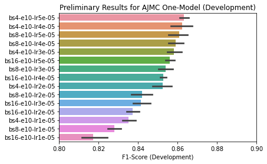
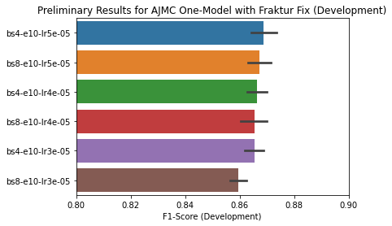
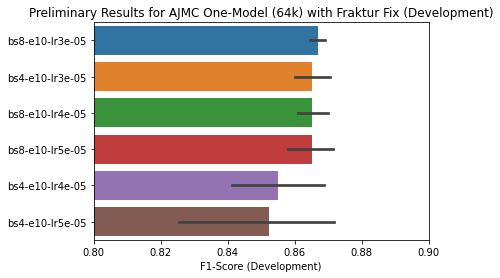

# HIPE-2022

This readme contains the documentation for our HIPE-2022 submission. Stay tuned!

# Setup

In order to get reproducible results across different machines, we pin the following
dependencies:

| Library/Dependency | Commit/Version
| ------------------ | --------------
| Transformers       | [`12428f0`](https://github.com/huggingface/transformers/commit/12428f0ef15bb3631e7a5f04672ddb05f363de97)
| Flair              | [`88dc52f`](https://github.com/flairNLP/flair/commit/88dc52ff478f627fd87c9bf971bd6e3042631093)
| NVIDIA PyTorch     | `nvcr.io/nvidia/pytorch:22.01-py3`

We recommend using NVIDIA Docker in order to train models. A typical docker setup can be started with:

```bash
$ docker run --gpus all --shm-size 64G -v /home/arthur:/mnt -it --rm nvcr.io/nvidia/pytorch:22.01-py3 /bin/bash
```

Please adjust your desired mountpoints.

After entering the container, just install the following dependencies:

```bash
$ cd /mnt
$ git clone https://github.com/huggingface/transformers.git
$ cd transformers && git checkout 12428f0 && pip3 install -e . && cd ..
$ git clone https://github.com/flairNLP/flair.git
$ cd flair && git checkout 08f14ff && pip3 install -e . && cd ..

# Clone this repository
$ git clone https://github.com/dbmdz/clef-hipe.git
$ cd clef-hipe/experiments/clef-hipe-2022

# Run training!
$ python3 flair-fine-tuner.py ./configs/ajmc/ajmc_hmbert_de.json

# Get best configuration
$ python3 flair-log-parser.py "hipe2022-flert-fine-tune-ajmc/de-dbmdz/bert-base-historic-multilingual-cased-*"
```

# Baseline experiments

We perform a (non-extensive) hyper-parameter search:

| Parameter     | Values
| ------------- | ------
| Batch Size    | `[4, 8]`
| Epoch         | `[5, 10]`
| Learning Rate | `[3e-5, 5e-5]`
| Seed          | `[1, 2, 3, 4, 5]`

For each language, 40 models are trained. The script `flair-log-parser.py` parses all training logs and outputs the best
configuration (Batch Size, Epoch and Learning Rate) averaged over all seeds.

We use version 2 of the HIPE-2022 datasets for baseline experiments.

## AJMC

### German

[Configuration](configs/ajmc/ajmc_hmbert_de.json): 1100 train + 206 dev sentences (incl. doc marker).
Label set: `[scope, pers, work, loc, object, date]`.

| Best configuration | Language Model | Result
| ------------------ | -------------- | ------
| `bs4-e10-lr5e-05`  | hmBERT         | 86.21

### English

[Configuration](configs/ajmc/ajmc_hmbert_en.json): 1214 train + 266 dev sentences (incl. doc marker).
Label set: `[scope, pers, work, loc, date, object]`.

| Best configuration | Language Model | Result
| ------------------ | -------------- | ------
| `bs8-e10-lr5e-05`  | hmBERT         | 84.98

### French

[Configuration](configs/ajmc/ajmc_hmbert_fr.json): 966 train + 219 dev sentences (incl. doc marker).
Label set: `[scope, pers, work, loc, object, date]`.

| Best configuration | Language Model | Result
| ------------------ | -------------- | ------
| `bs8-e10-lr5e-05`  | hmBERT         | 85.69

### One Model

In this experiment, we use the training and development data from all languages (German, English and French)
to train one model. We report best configuration here and perform a detailed per-language analysis later on:

| Best configuration | Language Model | Result
| ------------------ | -------------- | ------
| `bs4-e10-lr5e-05`  | hmBERT         | 85.69

Then we use all 5 models from the `bs4-e10-lr5e-05` configuration, evaluate them for each language and report
averaged F1-Score:

| Language | Result
| -------- | ------
| German   | 86.68
| English  | 84.85
| French   | 85.09

Comparison table between "one model" vs. "single model" for AJMC:

| Language | Single Model | One Model
| -------- | ------------ | ---------
| German   | 86.21        | 86.68
| English  | 84.98        | 84.85
| French   | 85.69        | 85.09

### Ensembling

The script `flair-ensembler.py` can be used to ensemble made predictions from Flair via simple majority vote,
based on the Flair predictions in `dev.tsv` for each run:

| Language | Single Model | Ensemble (Single Model)
| -------- | ------------ | -----------------------
| German   | 86.21        | 86.85
| English  | 84.98        | 86.39
| French   | 85.69        | 85.86

For the ensembling approach, the official CoNLL-2003 evaluation script is used.

## NewsEye

### Finnish

[Configuration](./configs/newseye/newseye_hmbert_fi.json): 1166 train + 165 dev sentences (incl. doc marker).
Label set: `[HumanProd, LOC, ORG, PER]`.

| Best configuration | Language Model | Result
| ------------------ | -------------- | ------
| `bs4-e10-lr5e-05`  | hmBERT         | 75.34

### Swedish

[Configuration](./configs/newseye/newseye_hmbert_sv.json): 1085 train + 148 dev sentcnes (incl. doc marker).
Label set: `[HumanProd, LOC, ORG, PER]`.

| Best configuration | Language Model | Result
| ------------------ | -------------- | ------
| `bs4-e10-lr3e-05`  | hmBERT         | 80.63

### One Model

In this experiment, we use the training and development data from all languages
(Swedish and Finnish) to train one model. We report best configuration here and
perform a detailed per-language analysis later on:

| Best configuration | Language Model | Result
| ------------------ | -------------- | ------
| `bs8-e10-lr5e-05`  | hmBERT         | 80.15

hen we use all 5 models from the `bs8-e10-lr5e-05` configuration, evaluate them
for each language and report averaged F1-Score:

| Language | Result
| -------- | ------
| Finnish  | 78.51
| Swedish  | 81.53

### Ensembling

| Language | Single Model | Ensemble (Single Model)
| -------- | ------------ | -----------------------
| Finnish  | 75.34        | 76.63
| Swedish  | 80.63        | 79.93

## LeTemps

[Configuration](./configs/letemps/letemps_hmbert_fr.json): 14465 train + 1392 dev sentences (incl. doc marker).
Label set: `[loc, org, pers]`.

| Best configuration | Language Model | Result
| ------------------ | -------------- | ------
| `bs8-e10-lr5e-05`  | hmBERT         | 65.53

### Ensembling

| Single Model | Ensemble (Single Model)
| ------------ | -----------------------
| 65.53        | 66.41

## TopRes19th

[Configuration](./configs/topres19th/topres19th_hmbert_en.json): 6183 train + 680 dev sentences (incl. doc marker).
Label set: `[BUILDING, LOC, STREET]`.

| Best configuration | Language Model | Result
| ------------------ | -------------- | ------
| `bs8-e10-lr5e-05`  | hmBERT         | 80.98

### Ensembling

| Single Model | Ensemble (Single Model)
| ------------ | -----------------------
| 80.98        | 81.39

# Baseline experiments - Word Embeddings

We use the official FastText Embeddings from CLEF-HIPE 2020 to train
baseline models, which can be found
[here](https://files.ifi.uzh.ch/cl/siclemat/impresso/clef-hipe-2020/fasttext/).

## AJMC

We use the standard feature-base approach for training a model with
FastText embeddings only.

Notice: we needed to modify the `FastText()` instance due to an
implementation error with latest Gensim version.

Hyper-param search is restricted to different batch sizes (4 and 8).

### German

| Best configuration | Word Embeddings (Size)                           | Result
| ------------------ | ------------------------------------------------ | ------
| `bs4-e200-lr0.1`   | `de-model-skipgram-300-minc20-ws5-maxn-0` (2.4G) | 68.64
| `bs8-e200-lr0.1`   | `de-model-skipgram-300-minc20-ws5-maxn-6` (14G)  | 75.71

### French

| Best configuration | Word Embeddings (Size)                           | Result
| ------------------ | ------------------------------------------------ | ------
| `bs4-e200-lr0.1`   | `fr-model-skipgram-300minc20-ws5-maxn-0` (1.8G)  | 56.88
| `bs4-e200-lr0.1`   | `fr-model-skipgram-300minc20-ws5-maxn-6` (13G)   | 76.58

### English

| Best configuration | Word Embeddings (Size)                           | Result
| ------------------ | ------------------------------------------------ | ------
| `bs4-e200-lr0.1`   | `en-model-skipgram-300-minc0-ws5-maxn-0` (0.9G)  | 63.10
| `bs4-e200-lr0.1`   | `en-model-skipgram-300-minc0-ws5-maxn-6` (2.1G)  | 76.76

# Baseline experiments - KB-NER experiments

We extract additional contexts for training and development instances using the
[KB-NER](https://github.com/Alibaba-NLP/KB-NER) implementation and fine-tune a
model for all three languages on the AJMC dataset:

| Best configuration | Language Model | KB context size | Result
| ------------------ | -------------- | --------------- | ------
| `bs4-e10-lr3e-05`  | hmBERT         | 128             | 85.30
| `bs4-e10-lr5e-05`  | hmBERT         | 256             | 85.07

The current baseline SOTA for the one-model approach is 85.69. The KB-NER approach
is worse than the baseline model, and also needs more computing resources
(GPU RAM, fine-tuning time). For this reason, we do not use the KB-NER approach for
our final submission.

The script `flair-fine-tuner-kb.py` can be used for fine-tuning models with the KB-NER
approach. The corresponding configuration file is located under
`./configs/ajmc/ajmc_hmbert_all_kb.json`.


Technically, we did overload the `TransformerWordEmbeddings` instance from
Flair to get fine-tuning working with left-contexts (coming from the KB).

# Baseline experiments - Multistage Fine-Tuning

Inspired by the [KB-NER](https://arxiv.org/abs/2203.00545) paper, we use a multistage
fine-tuning approach for our final submission.

In the first stage, we fine-tune one multi-lingual model over the training and
development of all three languages (German, English and French). Then we select the
best hyper-parameter configuration (combination of batch size, number of epochs and
learning rate). This will result in 5 best models (5 because of the number of random
seeds). Each of these best models are fine-tuned in the second stage:

The second stage will fine-tune models for each language (instead of fine-tuning one
model over all languages). In our preliminary results, this will heavily boost
performance:

| Seed | Stage 1 | Stage 2 - German | Stage 2 - English | Stage 2 - French
| ---- | ------- | ---------------- | ----------------- | ----------------
| 1    | 85.62   | 87.79            | 86.48             | 86.43
| 2    | 85.93   | 86.59            | 86.51             | 87.03
| 3    | 85.34   | 87.39            | 85.65             | 85.67
| 4    | 86.15   | 87.32            | 85.68             | 86.99
| 5    | 86.93   | 87.65            | 87.07             | 87.21
| Avg. | 85.99   | 87.35            | 86.28             | 86.67

Here's a performance comparison between single model, one model and multistage fine-tuning:

| Language | Single Model | One Model | Multistage
| -------- | ------------ | --------- | --------------
| German   | 86.21        | 86.68     | 87.35 (+0.67%)
| English  | 84.98        | 84.85     | 86.28 (+1.43%)
| French   | 85.69        | 85.09     | 86.67 (+1.58%)

Diff of multistage is compared against one model performance. Performance boost of
multistage approach is ~1.23% (average) compared to one model approach. Thus, we use
the multistage fine-tuning approach for our final submission.

We select the best-performing models within the best hyper-parameter configuration and
upload the model to the Hugging Face Model Hub:

| Language | Model Hub Link                                               | Flair identifier          | F1-Score | Configuration
| -------- | ------------------------------------------------------------ | ------------------------- | -------- | -----------------------
| German   | [here](https://huggingface.co/dbmdz/flair-hipe-2022-ajmc-de) | `flair-hipe-2022-ajmc-de` | 88.29    | `bs8-e5-lr3e-05-seed2`
| English  | [here](https://huggingface.co/dbmdz/flair-hipe-2022-ajmc-en) | `flair-hipe-2022-ajmc-en` | 87.29    | `bs8-e10-lr3e-05-seed5`
| French   | [here](https://huggingface.co/dbmdz/flair-hipe-2022-ajmc-fr) | `flair-hipe-2022-ajmc-fr` | 88.06    | `bs8-e10-lr3e-05-seed4`

The model can be loaded with:

```python
from flair.models import SequenceTagger

tagger: SequenceTagger = SequenceTagger.load("dbmdz/flair-hipe-2022-ajmc-de")
```

This will automatically download the model from the Hugging Face Model Hub, so it can be used within Flair. Additionally, all fine-tuning
parameters can be displayed with the `.print_model_card()` function:

```python
tagger.print_model_card()
```

Notice: in our pre-liminary experiments we used version 2.0 of the AJMC dataset. For our final submission we will use v2.1 and report back
results whenever fine-tuning has finished.

# Final submission

For our final submission we use multistage fine-tuning as described in the previous section.

## Stage 1 - hmBERT

For stage 1, we use the [following](configs/submission/ajmc/ajmc_hmbert_all_final.json) hyper-param search grid:

```json
{
    "seeds": [1,2,3,4,5],
    "batch_sizes": [4, 8, 16],
    "hf_model": "dbmdz/bert-base-historic-multilingual-cased",
    "context_size": 0,
    "epochs": [10],
    "learning_rates": [1e-5, 2e-5, 3e-5, 4e-5, 5e-5],
    "hipe_datasets": ["ajmc/en", "ajmc/de", "ajmc/fr"],
    "cuda": "0"
}
```

This fine-tunes 75 models in total. By using the `flair-log-parser.py` script we can find the best configuration for AJMC:

| Configuration      | F1-Scores                                | Averaged F1-Score
| ------------------ | ---------------------------------------- | -----------------
| `bs4-e10-lr5e-05`  | [0.8676, 0.8649, 0.8609, 0.8609, 0.8619] | 86.32
| `bs4-e10-lr4e-05`  | [0.8523, 0.8703, 0.8607, 0.8631, 0.8659] | 86.25
| `bs8-e10-lr5e-05`  | [0.8618, 0.8506, 0.8673, 0.8633, 0.8611] | 86.08
| `bs8-e10-lr4e-05`  | [0.8546, 0.8623, 0.8641, 0.8609, 0.8535] | 85.91
| `bs4-e10-lr3e-05`  | [0.8589, 0.8633, 0.8551, 0.8525, 0.8617] | 85.83
| `bs16-e10-lr5e-05` | [0.8574, 0.8525, 0.8539, 0.8593, 0.8581] | 85.62
| `bs8-e10-lr3e-05`  | [0.8495, 0.8599, 0.8512, 0.8575, 0.8522] | 85.41
| `bs16-e10-lr4e-05` | [0.8517, 0.8558, 0.8504, 0.8519, 0.8543] | 85.28
| `bs4-e10-lr2e-05`  | [0.8585, 0.8523, 0.8575, 0.8513, 0.8427] | 85.25
| `bs8-e10-lr2e-05`  | [0.8335, 0.8371, 0.8498, 0.8458, 0.8440] | 84.20
| `bs16-e10-lr3e-05` | [0.8508, 0.8360, 0.8423, 0.8393, 0.8385] | 84.14
| `bs16-e10-lr2e-05` | [0.8383, 0.8438, 0.8336, 0.8337, 0.8366] | 83.72
| `bs4-e10-lr1e-05`  | [0.8351, 0.8347, 0.8313, 0.8319, 0.8423] | 83.51
| `bs8-e10-lr1e-05`  | [0.8309, 0.8248, 0.8233, 0.8279, 0.8334] | 82.81
| `bs16-e10-lr1e-05` | [0.8091, 0.8299, 0.8162, 0.8195, 0.8120] | 81.73

Visualization:



We made the following observations:

* Batch size of 16 is not really helpful
* Learning rates of 1e-05 and 2e-05 are also not performing very well

Additionally, we found out that the AJMC uses Fraktur `ſ` and our hmBERT model has unfortunately never seen this character.
Thus, the hmBERT tokenizer will replace all tokens that contain `ſ` with an `[UNK]` token, which is really bad for the NER model performance.

We decided to write an own preprocessing function for AJMC dataset, that replaces all `ſ` with normal `s` characters and re-do the hyper-param search.
This time we use a slightly modified version and removed batch size `16` and learning rates `1e-05` and `2e-05` from our grid search, resulting in:

```json
{
    "seeds": [1,2,3,4,5],
    "batch_sizes": [4, 8],
    "hf_model": "dbmdz/bert-base-historic-multilingual-cased",
    "context_size": 0,
    "epochs": [10],
    "learning_rates": [3e-5, 4e-5, 5e-5],
    "hipe_datasets": ["ajmc/en", "ajmc/de", "ajmc/fr"],
    "cuda": "0"
}
```

This fine-tunes 30 models - the `flair-log-parser.py` outputs the following stats:

| Configuration     | F1-Scores                                | Averaged F1-Score
| ----------------- | ---------------------------------------- | -----------------
| `bs4-e10-lr5e-05` | [0.8721, 0.8764, 0.8604, 0.8672, 0.8682] | 86.89
| `bs8-e10-lr5e-05` | [0.8662, 0.8650, 0.8736, 0.8604, 0.8710] | 86.72
| `bs4-e10-lr4e-05` | [0.8702, 0.8695, 0.8611, 0.8699, 0.8616] | 86.65
| `bs8-e10-lr4e-05` | [0.8695, 0.8555, 0.8637, 0.8717, 0.8678] | 86.56
| `bs4-e10-lr3e-05` | [0.8701, 0.8609, 0.8625, 0.8638, 0.8702] | 86.55
| `bs8-e10-lr3e-05` | [0.8653, 0.8599, 0.8539, 0.8608, 0.8584] | 85.97

The Fraktur Fix boosts model performance from 86.32 to 86.89.

Visualization:



## Stage 1 - hmBERT 64k

Additionally, we fine-tune a model on a hmBERT model, that was is using a larger vocab size (64k instead of 32k) using the following
configuration:

```json
{
    "seeds": [1,2,3,4,5],
    "batch_sizes": [4, 8],
    "hf_model": "dbmdz/bert-base-historic-multilingual-64k-td-cased",
    "context_size": 0,
    "epochs": [10],
    "learning_rates": [3e-5, 4e-5, 5e-5],
    "hipe_datasets": ["ajmc/en", "ajmc/de", "ajmc/fr"],
    "cuda": "0"
}
```

The following results can be achieved:

| Configuration     | F1-Scores                                | Averaged F1-Score
| ----------------- | ---------------------------------------- | -----------------
| `bs8-e10-lr3e-05` | [0.8688, 0.8663, 0.8702, 0.8661, 0.8631] | 86.69
| `bs4-e10-lr3e-05` | [0.8595, 0.8612, 0.8599, 0.8710, 0.8751] | 86.53
| `bs8-e10-lr4e-05` | [0.8727, 0.8699, 0.8610, 0.8585, 0.8643] | 86.53
| `bs8-e10-lr5e-05` | [0.8712, 0.8605, 0.8746, 0.8526, 0.8665] | 86.51
| `bs4-e10-lr4e-05` | [0.8401, 0.8653, 0.8714, 0.8677, 0.8305] | 85.50
| `bs4-e10-lr5e-05` | [0.8730, 0.8535, 0.8565, 0.8005, 0.8785] | 85.24

The 64k model is slightly worse than 32k model: 86.69 vs. 86.89.

Visualization:



## Stage 2 - hmBERT

For Stage 2, we select the best performing model from the best configuration. Best configuration is `bs4-e10-lr5e-05` with the
following results for different seeds: [0.8721, 0.8764, 0.8604, 0.8672, 0.8682]. We use the model with seed 2, because it achieves
the highest F1-Score on development data: 87.64 from stage 1.

### German

For German we use the following configuration:

```json
{
    "seeds": [1,2,3,4,5],
    "batch_sizes": [4, 8],
    "best_model": "hipe2022-flert-fine-tune-ajmc/en-ajmc/de-ajmc/fr-dbmdz/bert-base-historic-multilingual-cased-bs4-wsFalse-e10-lr5e-05-layers-1-crfFalse-4/best-model.pt",
    "context_size": 0,
    "epochs": [5, 10],
    "learning_rates": [3e-5, 5e-5],
    "hipe_datasets": ["ajmc/de"],
    "cuda": "0"
}
```

Then the hyper-param search returns the following results for German:

| Configuration     | F1-Scores                                | Averaged F1-Score
| ----------------- | ---------------------------------------- | -----------------
| `bs8-e5-lr3e-05`  | [0.8960, 0.8916, 0.9147, 0.8889, 0.8976] | 89.78
| `bs4-e10-lr5e-05` | [0.8883, 0.9005, 0.8962, 0.8983, 0.8948] | 89.56
| `bs8-e10-lr3e-05` | [0.8962, 0.8935, 0.8984, 0.8900, 0.8983] | 89.53
| `bs8-e5-lr5e-05`  | [0.8798, 0.8961, 0.8943, 0.9034, 0.8991] | 89.45
| `bs8-e10-lr5e-05` | [0.9027, 0.8881, 0.8935, 0.8945, 0.8862] | 89.30
| `bs4-e10-lr3e-05` | [0.8736, 0.8900, 0.8956, 0.8892, 0.8886] | 88.74
| `bs4-e5-lr5e-05`  | [0.8889, 0.8774, 0.8927, 0.8865, 0.8908] | 88.73
| `bs4-e5-lr3e-05`  | [0.8864, 0.8940, 0.8848, 0.8824, 0.8883] | 88.72

We use the best performing model (91.47) for our final submission.

### English

For English we use the following configuration:

```json
{
    "seeds": [1,2,3,4,5],
    "batch_sizes": [4, 8],
    "best_model": "hipe2022-flert-fine-tune-ajmc/en-ajmc/de-ajmc/fr-dbmdz/bert-base-historic-multilingual-cased-bs4-wsFalse-e10-lr5e-05-layers-1-crfFalse-4/best-model.pt",
    "context_size": 0,
    "epochs": [5, 10],
    "learning_rates": [3e-5, 5e-5],
    "hipe_datasets": ["ajmc/en"],
    "cuda": "0"
}
```

Then the hyper-param search returns the following results for English:

| Configuration     | F1-Scores                                | Averaged F1-Score
| ----------------- | ---------------------------------------- | -----------------
| `bs4-e10-lr3e-05` | [0.8868, 0.8838, 0.8878, 0.8690, 0.8854] | 88.26
| `bs8-e10-lr3e-05` | [0.8799, 0.8788, 0.8751, 0.8884, 0.8844] | 88.13
| `bs8-e5-lr3e-05`  | [0.8810, 0.8790, 0.8667, 0.8747, 0.8817] | 87.66
| `bs4-e10-lr5e-05` | [0.8685, 0.8881, 0.8786, 0.8690, 0.8719] | 87.52
| `bs8-e10-lr5e-05` | [0.8676, 0.8764, 0.8740, 0.8806, 0.8676] | 87.32
| `bs4-e5-lr3e-05`  | [0.8708, 0.8723, 0.8711, 0.8795, 0.8676] | 87.23
| `bs8-e5-lr5e-05`  | [0.8663, 0.8716, 0.8807, 0.8772, 0.8602] | 87.12
| `bs4-e5-lr5e-05`  | [0.8717, 0.8551, 0.8772, 0.8528, 0.8612] | 86.36

We use the best performing model (88.78) for our final submission.

### French

For French we use the following configuration:

```json
{
    "seeds": [1,2,3,4,5],
    "batch_sizes": [4, 8],
    "best_model": "hipe2022-flert-fine-tune-ajmc/en-ajmc/de-ajmc/fr-dbmdz/bert-base-historic-multilingual-cased-bs4-wsFalse-e10-lr5e-05-layers-1-crfFalse-4/best-model.pt",
    "context_size": 0,
    "epochs": [5, 10],
    "learning_rates": [3e-5, 5e-5],
    "hipe_datasets": ["ajmc/fr"],
    "cuda": "0"
}
```

Then the hyper-param search returns the following results for English:

| Configuration     | F1-Scores                                | Averaged F1-Score
| ----------------- | ---------------------------------------- | -----------------
| `bs4-e10-lr3e-05` | [0.8557, 0.8547, 0.8607, 0.8619, 0.8618] | 85.90
| `bs8-e10-lr5e-05` | [0.8589, 0.8496, 0.8621, 0.8540, 0.8687] | 85.87
| `bs8-e10-lr3e-05` | [0.8611, 0.8586, 0.8557, 0.8525, 0.8557] | 85.67
| `bs4-e10-lr5e-05` | [0.8636, 0.8511, 0.8621, 0.8575, 0.8479] | 85.64
| `bs8-e5-lr5e-05`  | [0.8615, 0.8547, 0.8557, 0.8465, 0.8472] | 85.31
| `bs4-e5-lr5e-05`  | [0.8532, 0.8407, 0.8483, 0.8561, 0.8561] | 85.09
| `bs4-e5-lr3e-05`  | [0.8557, 0.8519, 0.8494, 0.8442, 0.8511] | 85.05
| `bs8-e5-lr3e-05`  | [0.8512, 0.8480, 0.8389, 0.8522, 0.8464] | 84.73

We use the best performing model (86.19) for our final submission.

## Stage 2 - hmBERT 64k

We also perform a stage 2 fine-tuning using the best configuration `bs8-e10-lr3e-05` with the best model (seed 3) that achieves 87.02 on development data
from stage 1.

### German

For German we use the following configuration:

```json
{
    "seeds": [1,2,3,4,5],
    "batch_sizes": [4, 8],
    "best_model": "hipe2022-flert-fine-tune-ajmc/en-ajmc/de-ajmc/fr-dbmdz/bert-base-historic-multilingual-64k-td-cased-bs8-wsFalse-e10-lr3e-05-layers-1-crfFalse-3/best-model.pt",
    "context_size": 0,
    "epochs": [5, 10],
    "learning_rates": [3e-5, 5e-5],
    "hipe_datasets": ["ajmc/de"],
    "cuda": "0"
}
```

The hyper-param search returns the following results for German:

| Configuration     | F1-Scores                                | Averaged F1-Score
| ----------------- | ---------------------------------------- | -----------------
| `bs8-e10-lr3e-05` | [0.9119, 0.9166, 0.8964, 0.8956, 0.9071] | 90.55
| `bs4-e10-lr3e-05` | [0.9078, 0.9007, 0.9084, 0.8972, 0.8966] | 90.21
| `bs8-e10-lr5e-05` | [0.8977, 0.9021, 0.9064, 0.8953, 0.8984] | 90.00
| `bs8-e5-lr5e-05`  | [0.9025, 0.8889, 0.8983, 0.9005, 0.8996] | 89.80
| `bs8-e5-lr3e-05`  | [0.8924, 0.8897, 0.8964, 0.8986, 0.8953] | 89.45
| `bs4-e5-lr5e-05`  | [0.9001, 0.9001, 0.8881, 0.8918, 0.8921] | 89.44
| `bs4-e5-lr3e-05`  | [0.8983, 0.8929, 0.8894, 0.8000, 0.8972] | 89.16
| `bs4-e10-lr5e-05` | [0.8961, 0.8937, 0.8794, 0.8935, 0.8935] | 89.12

We use the best performing model (91.66) for our final submission.

### English

For English we use the following configuration:

```json
{
    "seeds": [1,2,3,4,5],
    "batch_sizes": [4, 8],
    "best_model": "hipe2022-flert-fine-tune-ajmc/en-ajmc/de-ajmc/fr-dbmdz/bert-base-historic-multilingual-64k-td-cased-bs8-wsFalse-e10-lr3e-05-layers-1-crfFalse-3/best-model.pt",
    "context_size": 0,
    "epochs": [5, 10],
    "learning_rates": [3e-5, 5e-5],
    "hipe_datasets": ["ajmc/en"],
    "cuda": "0"
}
```

The hyper-param search returns the following results for English:

| Configuration     | F1-Scores                                | Averaged F1-Score
| ----------------- | ---------------------------------------- | -----------------
| `bs8-e10-lr3e-05` | [0.8692, 0.8804, 0.8722, 0.8711, 0.8660] | 87.18
| `bs8-e5-lr3e-05`  | [0.8759, 0.8619, 0.8769, 0.8741, 0.8633] | 87.04
| `bs4-e10-lr3e-05` | [0.8759, 0.8689, 0.8627, 0.8752, 0.8671] | 87.00
| `bs4-e5-lr5e-05`  | [0.8678, 0.8643, 0.8616, 0.8783, 0.8723] | 86.89
| `bs4-e5-lr3e-05`  | [0.8702, 0.8698, 0.8653, 0.8854, 0.8507] | 86.83
| `bs8-e10-lr5e-05` | [0.8616, 0.8857, 0.8660, 0.8489, 0.8613] | 86.47
| `bs8-e5-lr5e-05`  | [0.8627, 0.8551, 0.8667, 0.8698, 0.8643] | 86.37
| `bs4-e10-lr5e-05` | [0.7746, 0.8681, 0.8565, 0.8785, 0.8623] | 84.80


We use the best performing model (88.04) for our final submission.

### French

For French we use the following configuration:

```json
{
    "seeds": [1,2,3,4,5],
    "batch_sizes": [4, 8],
    "best_model": "hipe2022-flert-fine-tune-ajmc/en-ajmc/de-ajmc/fr-dbmdz/bert-base-historic-multilingual-64k-td-cased-bs8-wsFalse-e10-lr3e-05-layers-1-crfFalse-3/best-model.pt",
    "context_size": 0,
    "epochs": [5, 10],
    "learning_rates": [3e-5, 5e-5],
    "hipe_datasets": ["ajmc/fr"],
    "cuda": "0"
}
```

The hyper-param search returns the following results for English:

| Configuration     | F1-Scores                                | Averaged F1-Score
| ----------------- | ---------------------------------------- | -----------------
| `bs4-e10-lr5e-05` | [0.8539, 0.8524, 0.8539, 0.8360, 0.8529] | 84.98
| `bs8-e10-lr3e-05` | [0.8407, 0.8335, 0.8579, 0.8618, 0.8450] | 84.78
| `bs4-e5-lr5e-05`  | [0.8310, 0.8617, 0.8269, 0.8475, 0.8636] | 84.61
| `bs8-e10-lr5e-05` | [0.8468, 0.8243, 0.8489, 0.8539, 0.8557] | 84.59
| `bs4-e10-lr3e-05` | [0.8338, 0.8532, 0.8471, 0.8428, 0.8511] | 84.56
| `bs8-e5-lr3e-05`  | [0.8429, 0.8600, 0.8394, 0.8471, 0.8331] | 84.45
| `bs8-e5-lr5e-05`  | [0.8298, 0.8371, 0.8426, 0.8483, 0.8486] | 84.13
| `bs4-e5-lr3e-05`  | [0.8210, 0.8475, 0.8290, 0.8407, 0.8323] | 83.41

We use the best performing model (85.39) for our final submission.

## Predictions

In order to make predictions for our submission, the `flair-predictor.py` script can be used.

The following (masked) official test data must be downloaded first:

```bash
wget https://github.com/hipe-eval/HIPE-2022-data/raw/main/data/v2.1/ajmc/de/HIPE-2022-v2.1-ajmc-test-allmasked-de.tsv
wget https://github.com/hipe-eval/HIPE-2022-data/raw/main/data/v2.1/ajmc/en/HIPE-2022-v2.1-ajmc-test-allmasked-en.tsv
wget https://github.com/hipe-eval/HIPE-2022-data/raw/main/data/v2.1/ajmc/fr/HIPE-2022-v2.1-ajmc-test-allmasked-fr.tsv
```

### hmBERT

System predictions can be made with the following commands:

```bash
python3 flair-predictor.py HIPE-2022-v2.1-ajmc-test-allmasked-de.tsv ./system_outputs/ajmc-de-NERCCoarse-pre_1.tsv flair-hipe-2022-ajmc-de
python3 flair-predictor.py HIPE-2022-v2.1-ajmc-test-allmasked-en.tsv ./system_outputs/ajmc-en-NERCCoarse-pre_1.tsv flair-hipe-2022-ajmc-en
python3 flair-predictor.py HIPE-2022-v2.1-ajmc-test-allmasked-fr.tsv ./system_outputs/ajmc-fr-NERCCoarse-pre_1.tsv flair-hipe-2022-ajmc-fr
```

### hmBERT 64k

System predictions can be made with the following commands:

```bash
python3 flair-predictor.py HIPE-2022-v2.1-ajmc-test-allmasked-de.tsv ./system_outputs/ajmc-de-NERCCoarse-pre_2.tsv flair-hipe-2022-ajmc-de-64k
python3 flair-predictor.py HIPE-2022-v2.1-ajmc-test-allmasked-en.tsv ./system_outputs/ajmc-en-NERCCoarse-pre_2.tsv flair-hipe-2022-ajmc-en-64k
python3 flair-predictor.py HIPE-2022-v2.1-ajmc-test-allmasked-fr.tsv ./system_outputs/ajmc-fr-NERCCoarse-pre_2.tsv flair-hipe-2022-ajmc-fr-64k
```

### Post-processing

We automatically correct minor tagging issue with the `postprocess.py` script:

```bash
python3 postprocess.py ./system_outputs/ajmc-de-NERCCoarse-pre_1.tsv ./system_outputs/ajmc-de-NERCCoarse-post_1.tsv
python3 postprocess.py ./system_outputs/ajmc-en-NERCCoarse-pre_1.tsv ./system_outputs/ajmc-en-NERCCoarse-post_1.tsv
python3 postprocess.py ./system_outputs/ajmc-fr-NERCCoarse-pre_1.tsv ./system_outputs/ajmc-fr-NERCCoarse-post_1.tsv

python3 postprocess.py ./system_outputs/ajmc-de-NERCCoarse-pre_2.tsv ./system_outputs/ajmc-de-NERCCoarse-post_2.tsv
python3 postprocess.py ./system_outputs/ajmc-en-NERCCoarse-pre_2.tsv ./system_outputs/ajmc-en-NERCCoarse-post_2.tsv
python3 postprocess.py ./system_outputs/ajmc-fr-NERCCoarse-pre_2.tsv ./system_outputs/ajmc-fr-NERCCoarse-post_2.tsv
```

### Final System Output Submission

We use the `*-post_[1-2].tsv` as our final submissions. To comply with the official HIPE-2022 naming convention, we use the following mapping
for our final submission:

| Original Name                   | Submission Name
| ------------------------------- | ---------------
| `ajmc-de-NERCCoarse-post_1.tsv` | `HISTeria_bundle4_ajmc_de_1.tsv`
| `ajmc-de-NERCCoarse-post_2.tsv` | `HISTeria_bundle4_ajmc_de_2.tsv`
| `ajmc-en-NERCCoarse-post_1.tsv` | `HISTeria_bundle4_ajmc_en_1.tsv`
| `ajmc-en-NERCCoarse-post_2.tsv` | `HISTeria_bundle4_ajmc_en_2.tsv`
| `ajmc-fr-NERCCoarse-post_1.tsv` | `HISTeria_bundle4_ajmc_fr_1.tsv`
| `ajmc-fr-NERCCoarse-post_2.tsv` | `HISTeria_bundle4_ajmc_fr_2.tsv`

## Final models

We release the multi-lingual models that were fine-tuned in stage 1, incl. breakdown analysis for all three languages:

| Backbone LM                  | Configuration       | F1-Score (All, Development) | F1-Score (German, Development) | F1-Score (English, Development) | F1-Score (French, Development) | Model Hub Link
| ---------------------------- | ------------------- | --------------------------- | ------------------------------ | ------------------------------- | ------------------------------ | -----------------------------------------------------------------
| hmBERT (32k)                 | `bs4-e10-lr5e-05#4` | 87.64                       | 89.26                          | 88.78                           | 84.80                          | [here](https://huggingface.co/dbmdz/flair-hipe-2022-ajmc-all)
| hmBERT (64k, token dropping) | `bs8-e10-lr3e-05#3` | 87.02                       | 88.89                          | 86.63                           | 85.50                          | [here](https://huggingface.co/dbmdz/flair-hipe-2022-ajmc-all-64k)

We then release our final models on the Hugging Face Model Hub:

| Language       | Configuration       | F1-Score (Development) | Backbone LM                  | Model Hub Link
| -------------- | ------------------- | ---------------------- | ---------------------------- | ----------------------------------------------------------------
| German (AJMC)  | `bs8-e5-lr3e-05#3`  | 91.47                  | hmBERT (32k)                 | [here](https://huggingface.co/dbmdz/flair-hipe-2022-ajmc-de)
| German (AJMC)  | `bs8-e10-lr3e-05#2` | 91.66                  | hmBERT (64k, token dropping) | [here](https://huggingface.co/dbmdz/flair-hipe-2022-ajmc-de-64k)
| English (AJMC) | `bs4-e10-lr3e-05#3` | 88.78                  | hmBERT (32k)                 | [here](https://huggingface.co/dbmdz/flair-hipe-2022-ajmc-en)
| English (AJMC) | `bs8-e10-lr3e-05#2` | 88.04                  | hmBERT (64k, token dropping) | [here](https://huggingface.co/dbmdz/flair-hipe-2022-ajmc-en-64k)
| French (AJMC)  | `bs4-e10-lr3e-05#4` | 86.19                  | hmBERT (32k)                 | [here](https://huggingface.co/dbmdz/flair-hipe-2022-ajmc-fr)
| French (AJMC)  | `bs4-e10-lr5e-05#1` | 85.39                  | hmBERT (64k, token dropping) | [here](https://huggingface.co/dbmdz/flair-hipe-2022-ajmc-fr-64k)

# Post-submission Models

We are constantly improving our NER models and this section covers all experiments that we performed after the official submission deadline of HIPE-2022.

The following table shows multi-lingual models that were fine-tuned in stage 1, incl. breakdown analysis for all three languages. For this ablation, we use
different hmBERT models with different model sizes, originally introduced [here](https://github.com/dbmdz/clef-hipe/blob/main/hlms.md#smaller-multilingual-models).

For baseline we use our 12 layer hmBERT Base model.

| Backbone LM                  | Configuration       | F1-Score (All, Development) | F1-Score (German, Development) | F1-Score (English, Development) | F1-Score (French, Development) | Model Hub Link
| ---------------------------- | ------------------- | --------------------------- | ------------------------------ | ------------------------------- | ------------------------------ | -----------------------------------------------------------------
| hmBERT Base                  | `bs4-e10-lr5e-05#4` | 87.64                       | 89.26                          | 88.78                           | 84.80                          | [here](https://huggingface.co/dbmdz/flair-hipe-2022-ajmc-all)
| hmBERT Medium                | `bs4-e10-lr5e-05#2` | 85.74                       | 88.19                          | 84.43                           | 84.62                          | n.a.
| hmBERT Small                 | n.a.                | n.a.                        | n.a.                           | n.a.                            | n.a.                           | n.a.
| hmBERT Mini                  | n.a.                | n.a.                        | n.a.                           | n.a.                            | n.a.                           | n.a.
| hmBERT Tiny                  | n.a.                | n.a.                        | n.a.                           | n.a.                            | n.a.                           | n.a.
