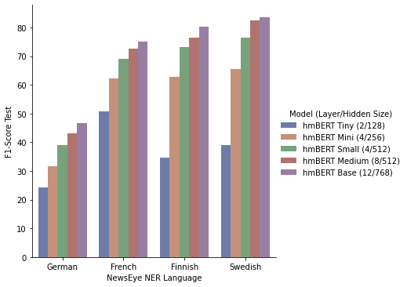
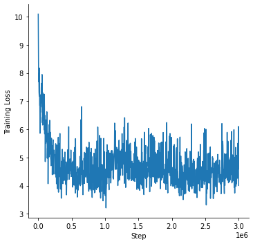
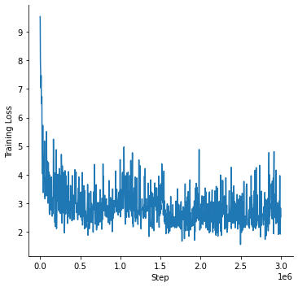
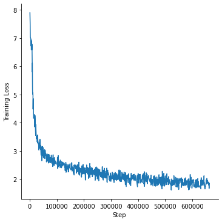

# Historic Language Models (HLMs)

## Languages

Our Historic Language Models Zoo contains support for the following languages - incl. their training data source:

| Language | Training data | Size 
| -------- | ------------- | ----
| German   | [Europeana](http://www.europeana-newspapers.eu/)       | 13-28GB (filtered)
| French   | [Europeana](http://www.europeana-newspapers.eu/)       | 11-31GB (filtered)
| English  | [British Library](https://data.bl.uk/digbks/db14.html) | 24GB (year filtered)
| Finnish  | [Europeana](http://www.europeana-newspapers.eu/)       | 1.2GB
| Swedish  | [Europeana](http://www.europeana-newspapers.eu/)       | 1.1GB

## Models

At the moment, the following models are available on the model hub:

| Model identifier                              | Model Hub link
| --------------------------------------------- | --------------------------------------------------------------------------
| `dbmdz/bert-base-historic-multilingual-cased` | [here](https://huggingface.co/dbmdz/bert-base-historic-multilingual-cased)
| `dbmdz/bert-base-historic-english-cased`      | [here](https://huggingface.co/dbmdz/bert-base-historic-english-cased)
| `dbmdz/bert-base-finnish-europeana-cased`     | [here](https://huggingface.co/dbmdz/bert-base-finnish-europeana-cased)
| `dbmdz/bert-base-swedish-europeana-cased`     | [here](https://huggingface.co/dbmdz/bert-base-swedish-europeana-cased)

We also released smaller models for the multilingual model:

| Model identifier | Model Hub link
| ----------------------------------------------- | ---------------------------------------------------------------------------
| `dbmdz/bert-tiny-historic-multilingual-cased`   | [here](https://huggingface.co/dbmdz/bert-tiny-historic-multilingual-cased)
| `dbmdz/bert-mini-historic-multilingual-cased`   | [here](https://huggingface.co/dbmdz/bert-mini-historic-multilingual-cased)
| `dbmdz/bert-small-historic-multilingual-cased`  | [here](https://huggingface.co/dbmdz/bert-small-historic-multilingual-cased)
| `dbmdz/bert-medium-historic-multilingual-cased` | [here](https://huggingface.co/dbmdz/bert-base-historic-multilingual-cased)

**Notice**: We have released language models for Historic German and French trained on more noisier data earlier - see
[this repo](https://github.com/stefan-it/europeana-bert) for more information:

| Model identifier                              | Model Hub link
| --------------------------------------------- | --------------------------------------------------------------------------
| `dbmdz/bert-base-german-europeana-cased`      | [here](https://huggingface.co/dbmdz/bert-base-german-europeana-cased)
| `dbmdz/bert-base-french-europeana-cased`      | [here](https://huggingface.co/dbmdz/bert-base-french-europeana-cased)

# Corpora Stats

## German Europeana Corpus

We provide some statistics using different thresholds of ocr confidences, in order to shrink down the corpus size
and use less-noisier data:

| OCR confidence | Size
| -------------- | ----
| **0.60**       | 28GB
| 0.65           | 18GB
| 0.70           | 13GB

For the final corpus we use a OCR confidence of 0.6 (28GB). The following plot shows a tokens per year distribution:


## French Europeana Corpus

Like German, we use different ocr confidence thresholds:

| OCR confidence | Size
| -------------- | ----
| 0.60           | 31GB
| 0.65           | 27GB
| **0.70**       | 27GB
| 0.75           | 23GB
| 0.80           | 11GB

For the final corpus we use a OCR confidence of 0.7 (27GB). The following plot shows a tokens per year distribution:


## British Library Corpus

Metadata is taken from [here](https://data.bl.uk/digbks/DB21.html). Stats incl. year filtering:

| Years             | Size
| ----------------- | ----
| ALL               | 24GB
| >= 1800 && < 1900 | 24GB

We use the year filtered variant. The following plot shows a tokens per year distribution:


## Finnish Europeana Corpus

| OCR confidence | Size
| -------------- | ----
| 0.60           | 1.2GB

The following plot shows a tokens per year distribution:


## Swedish Europeana Corpus

| OCR confidence | Size
| -------------- | ----
| 0.60           | 1.1GB

The following plot shows a tokens per year distribution:


## All Corpora

The following plot shows a tokens per year distribution of the complete training corpus:


# Multilingual Vocab generation

For the first attempt, we use the first 10GB of each pretraining corpus. We upsample both Finnish and Swedish to ~10GB.
The following tables shows the exact size that is used for generating a 32k and 64k subword vocabs:

| Language | Size
| -------- | ----
| German   | 10GB
| French   | 10GB
| English  | 10GB
| Finnish  | 9.5GB
| Swedish  | 9.7GB

We then calculate the subword fertility rate and portion of `[UNK]`s over the following NER corpora:

| Language | NER corpora
| -------- | ------------------
| German   | CLEF-HIPE, NewsEye
| French   | CLEF-HIPE, NewsEye
| English  | CLEF-HIPE
| Finnish  | NewsEye
| Swedish  | NewsEye

Breakdown of subword fertility rate and unknown portion per language for the 32k vocab:

| Language | Subword fertility  | Unknown portion
| -------- | ------------------ | ---------------
| German   | 1.43               | 0.0004
| French   | 1.25               | 0.0001
| English  | 1.25               | 0.0
| Finnish  | 1.69               | 0.0007
| Swedish  | 1.43               | 0.0

Breakdown of subword fertility rate and unknown portion per language for the 64k vocab:

| Language | Subword fertility  | Unknown portion
| -------- | ------------------ | ---------------
| German   | 1.31               | 0.0004
| French   | 1.16               | 0.0001
| English  | 1.17               | 0.0
| Finnish  | 1.54               | 0.0007
| Swedish  | 1.32               | 0.0

# Final pretraining corpora

We upsample Swedish and Finnish to ~27GB. The final stats for all pretraining corpora can be seen here:

| Language | Size
| -------- | ----
| German   | 28GB
| French   | 27GB
| English  | 24GB
| Finnish  | 27GB
| Swedish  | 27GB

Total size is 130GB.

# Smaller multilingual models

Inspired by the ["Well-Read Students Learn Better: On the Importance of Pre-training Compact Models"](https://arxiv.org/abs/1908.08962)
paper, we train smaller models (different layers and hidden sizes), and report number of parameters and pre-training costs:

| Model (Layer / Hidden size) | Parameters  | Pre-Training time
| --------------------------- | ----------: | ----------------------:
| hmBERT Tiny   ( 2/128)      |   4.58M     |  4.3 sec / 1,000 steps
| hmBERT Mini   ( 4/256)      |  11.55M     | 10.5 sec / 1,000 steps
| hmBERT Small  ( 4/512)      |  29.52M     | 20.7 sec / 1,000 steps
| hmBERT Medium ( 8/512)      |  42.13M     | 35.0 sec / 1,000 steps
| hmBERT Base   (12/768)      | 110.62M     | 80.0 sec / 1,000 steps

We then perform downstream evaluations on the multilingual [NewsEye](https://zenodo.org/record/4573313#.Ya3oVr-ZNzU) dataset:



# Pretraining

## Multilingual model - hmBERT Base

We train a multilingual BERT model using the 32k vocab with the official BERT implementation
on a v3-32 TPU using the following parameters:

```bash
python3 run_pretraining.py --input_file gs://histolectra/historic-multilingual-tfrecords/*.tfrecord \
--output_dir gs://histolectra/bert-base-historic-multilingual-cased \
--bert_config_file ./config.json \
--max_seq_length=512 \
--max_predictions_per_seq=75 \
--do_train=True \
--train_batch_size=128 \
--num_train_steps=3000000 \
--learning_rate=1e-4 \
--save_checkpoints_steps=100000 \
--keep_checkpoint_max=20 \
--use_tpu=True \
--tpu_name=electra-2 \
--num_tpu_cores=32
```

The following plot shows the pretraining loss curve:


## Smaller multilingual models

We use the same parameters as used for training the base model.

### hmBERT Tiny

The following plot shows the pretraining loss curve for the tiny model:



### hmBERT Mini

The following plot shows the pretraining loss curve for the mini model:


### hmBERT Small

The following plot shows the pretraining loss curve for the small model:



### hmBERT Medium

The following plot shows the pretraining loss curve for the medium model:


## English model

The English BERT model - with texts from British Library corpus - was trained with the Hugging Face
JAX/FLAX implementation for 10 epochs (approx. 1M steps) on a v3-8 TPU, using the following command:

```bash
python3 run_mlm_flax.py --model_type bert \
--config_name /mnt/datasets/bert-base-historic-english-cased/ \
--tokenizer_name /mnt/datasets/bert-base-historic-english-cased/ \
--train_file /mnt/datasets/bl-corpus/bl_1800-1900_extracted.txt \
--validation_file /mnt/datasets/bl-corpus/english_validation.txt \
--max_seq_length 512 \
--per_device_train_batch_size 16 \
--learning_rate 1e-4 \
--num_train_epochs 10 \
--preprocessing_num_workers 96 \
--output_dir /mnt/datasets/bert-base-historic-english-cased-512-noadafactor-10e \
--save_steps 2500 \
--eval_steps 2500 \
--warmup_steps 10000 \
--line_by_line \
--pad_to_max_length
```

The following plot shows the pretraining loss curve:


## Finnish model

The BERT model - with texts from Finnish part of Europeana - was trained with the Hugging Face
JAX/FLAX implementation for 40 epochs (approx. 1M steps) on a v3-8 TPU, using the following command:

```bash
python3 run_mlm_flax.py --model_type bert \
--config_name /mnt/datasets/bert-base-finnish-europeana-cased/ \
--tokenizer_name /mnt/datasets/bert-base-finnish-europeana-cased/ \
--train_file /mnt/datasets/hlms/extracted_content_Finnish_0.6.txt \
--validation_file /mnt/datasets/hlms/finnish_validation.txt \
--max_seq_length 512 \
--per_device_train_batch_size 16 \
--learning_rate 1e-4 \
--num_train_epochs 40 \
--preprocessing_num_workers 96 \
--output_dir /mnt/datasets/bert-base-finnish-europeana-cased-512-dupe1-noadafactor-40e \
--save_steps 2500 \
--eval_steps 2500 \
--warmup_steps 10000 \
--line_by_line \
--pad_to_max_length
```

The following plot shows the pretraining loss curve:


## Swedish model

The BERT model - with texts from Swedish part of Europeana - was trained with the Hugging Face
JAX/FLAX implementation for 40 epochs (approx. 660K steps) on a v3-8 TPU, using the following command:

```bash
python3 run_mlm_flax.py --model_type bert \
--config_name /mnt/datasets/bert-base-swedish-europeana-cased/ \
--tokenizer_name /mnt/datasets/bert-base-swedish-europeana-cased/ \
--train_file /mnt/datasets/hlms/extracted_content_Swedish_0.6.txt \
--validation_file /mnt/datasets/hlms/swedish_validation.txt \
--max_seq_length 512 \
--per_device_train_batch_size 16 \
--learning_rate 1e-4 \
--num_train_epochs 40 \
--preprocessing_num_workers 96 \
--output_dir /mnt/datasets/bert-base-swedish-europeana-cased-512-dupe1-noadafactor-40e \
--save_steps 2500 \
--eval_steps 2500 \
--warmup_steps 10000 \
--line_by_line \
--pad_to_max_length
```

The following plot shows the pretraining loss curve:



# Acknowledgments

Research supported with Cloud TPUs from Google's TPU Research Cloud (TRC) program, previously known as
TensorFlow Research Cloud (TFRC). Many thanks for providing access to the TRC ❤️

Thanks to the generous support from the [Hugging Face](https://huggingface.co/) team,
it is possible to download both cased and uncased models from their S3 storage 🤗
